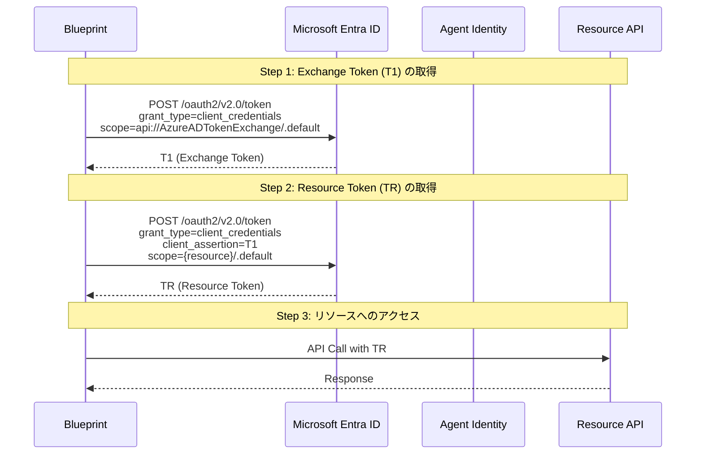
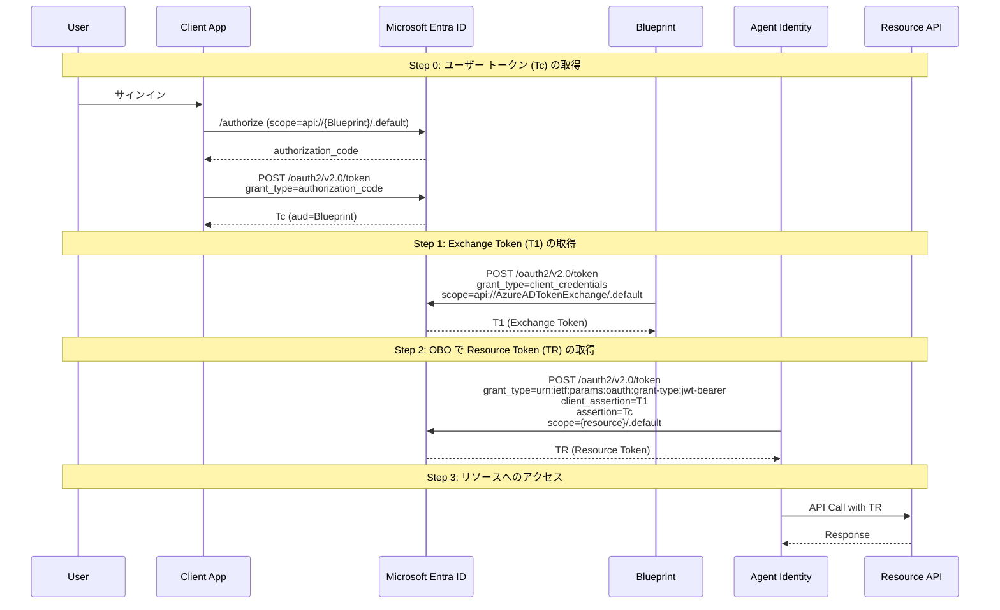
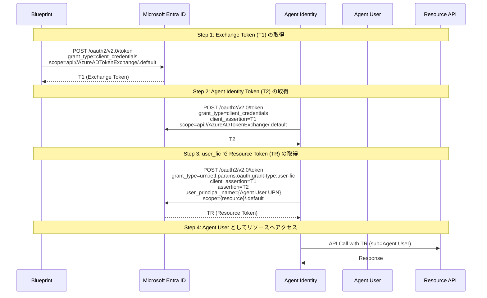

# Microsoft Entra Agent ID - REST Client リクエスト集

Microsoft Entra Agent ID の検証環境構築と認証フローを VS Code 拡張機能 [REST Client](https://marketplace.visualstudio.com/items?itemName=humao.rest-client) で実行するためのリクエスト集です。

## ファイル一覧

| ファイル | 内容 |
|---|---|
| [AgentID-BlueprintSetup.http](AgentID-BlueprintSetup.http) | 検証環境の構築 (Blueprint 作成・SP 作成・シークレット作成・権限割り当て・Agent Identity 作成等) |
| [AgentID-AutonomousAppFlow.http](AgentID-AutonomousAppFlow.http) | Autonomous App Flow - Agent ID がユーザーなしで自律的にリソースにアクセス |
| [AgentID-OBOFlow.http](AgentID-OBOFlow.http) | On-Behalf-Of Flow - サインイン済みユーザーの代理として Agent ID がリソースにアクセス |
| [AgentID-AgentUserFlow.http](AgentID-AgentUserFlow.http) | Agent User Flow - Agent ID に紐づく Agent User としてリソースにアクセス |

## 前提条件

- Agent ID (Preview) が有効な Microsoft Entra テナント
- **Agent AI Administrator** または **Agent ID Developer** ロール
- VS Code + [REST Client 拡張機能](https://marketplace.visualstudio.com/items?itemName=humao.rest-client)
- すべてのリクエストは **Microsoft Graph beta エンドポイント** を使用 (v1.0 は未サポート)

## セットアップ手順

### 1. Blueprint の作成 (`AgentID-BlueprintSetup.http`)

以下の順序で実行します。各 Step のレスポンスから次の Step で必要な値を取得してください。

1. **Step 1**: Blueprint (Application) の作成 → レスポンスから `appId` と `id` を控える
2. **Step 2**: Blueprint の Service Principal 作成 → レスポンスから `id` (SP Object ID) を控える
3. **Step 3**: クライアント シークレットの作成 → レスポンスから `secretText` を控える
   - MCAPS テナント等でシークレットがブロックされている場合は先に **Step 3a** でポリシーを緩和する
4. **Step 4 / 4a**: 必要な API 権限の割り当て (Delegated / Application)
   - リソース SP の Object ID は「確認用クエリ: リソース SP の Object ID を取得」で取得可能
5. **Step 5**: Agent Identity (エージェント インスタンス) の作成 → レスポンスから `id` と `appId` を控える
6. **Step 5a** (任意): Agent User の作成 (Agent User Flow を検証する場合のみ)

### 2. 認証フローの検証

セットアップ完了後、検証したいフローの `.http` ファイルを開いて実行します。

## Agent ID の認証フロー概要

Agent ID の認証は、従来のアプリ登録と異なり **2 段階以上のトークン交換** が必要です。
すべてのフローで共通する最初のステップは、Blueprint の資格情報で **Exchange Token (T1)** を取得することです。

```
Blueprint (資格情報) → T1 → Agent Identity (T1 を提示) → Resource Token
```

### Autonomous App Flow (App-only)

ユーザー コンテキストなしで Agent ID が自律的にリソースにアクセスするフローです。

```
Blueprint --[client_credentials]--> T1# Microsoft Entra Agent ID - REST Client リクエスト集

Microsoft Entra Agent ID の検証環境構築と認証フローを VS Code 拡張機能 [REST Client](https://marketplace.visualstudio.com/items?itemName=humao.rest-client) で実行するためのリクエスト集です。

## ファイル一覧

| ファイル | 内容 |
|---|---|
| [AgentID-BlueprintSetup.http](AgentID-BlueprintSetup.http) | 検証環境の構築 (権限割り当て・Agent User 作成・確認用クエリ・クリーンアップ等。Blueprint・Agent Identity・シークレットは管理センターで作成) |
| [AgentID-AutonomousAppFlow.http](AgentID-AutonomousAppFlow.http) | Autonomous App Flow - Agent ID がユーザーなしで自律的にリソースにアクセス |
| [AgentID-OBOFlow.http](AgentID-OBOFlow.http) | On-Behalf-Of Flow - サインイン済みユーザーの代理として Agent ID がリソースにアクセス |
| [AgentID-AgentUserFlow.http](AgentID-AgentUserFlow.http) | Agent User Flow - Agent ID に紐づく Agent User としてリソースにアクセス |

## 前提条件

- Agent ID (Preview) が有効な Microsoft Entra テナント
- **Agent AI Administrator** または **Agent ID Developer** ロール
- VS Code + [REST Client 拡張機能](https://marketplace.visualstudio.com/items?itemName=humao.rest-client)
- すべてのリクエストは **Microsoft Graph beta エンドポイント** を使用 (v1.0 は未サポート)

## セットアップ手順

### 1. Blueprint の作成 (Microsoft Entra 管理センター)

Blueprint と Blueprint Principal は Microsoft Entra 管理センターのウィザードで作成します。

1. [Microsoft Entra 管理センター](https://entra.microsoft.com/) にサインインする
2. **Entra ID** > **Agents** > **Agent Blueprints** に移動する
3. **New agent blueprint** を選択する
4. **基本** タブで **エージェント ブループリント名** を入力し、**次へ** を選択する
5. **所有者とスポンサー** タブで必要に応じて所有者・スポンサーを設定し、**次へ** を選択する
6. 設定を確認し、**作成** を選択する
7. 作成後、ブループリントの詳細ページで `Blueprint app ID`  と `Blueprint object ID` と `Blueprint principal object ID` を控える

> **Note**: 管理センターのウィザードでは Blueprint と Blueprint Principal が自動的に作成されます。`AgentID-BlueprintSetup.http` の Step 1・Step 2 は不要です。

参考: [エージェント ID ブループリントを作成する - Microsoft Learn](https://learn.microsoft.com/ja-jp/entra/agent-id/create-blueprint?tabs=microsoft-entra-admin-center#use-the-microsoft-entra-admin-center)

### 2. Blueprint のクライアント シークレット作成 (Microsoft Entra 管理センター)

Blueprint の詳細ページからクライアント シークレットを作成します。

1. 管理センターで **Entra ID** > **Agents** > **Agent Blueprints** に移動し、手順 1 で作成した Blueprint を選択する
2. 左メニューの **開発者設定** > **資格情報** を選択する
3. **クライアント シークレット** タブを選択する
4. **新しいクライアント シークレット** を選択する
5. シークレットの **説明** を入力し、**有効期限** の期間を選択する
6. **追加** を選択する
7. 表示されたシークレット値 (`secretText`) をすぐにコピーして控える (ページを離れると再表示不可)


参考: [エージェント ID ブループリントの管理 - 資格情報を管理する](https://learn.microsoft.com/ja-jp/entra/agent-id/manage-agent-blueprint#manage-credentials)

### 2a. Blueprint の API 権限の割り当て (`AgentID-BlueprintSetup.http`)

Blueprint Principal に必要な API 権限を `AgentID-BlueprintSetup.http` で割り当てます。

1. **Step 4**: Delegated Permission の割り当て (oauth2PermissionGrants)
   - `clientId` には Blueprint Principal の Object ID を指定する
   - リソース SP の Object ID は「確認用クエリ: リソース SP の Object ID を取得」で取得可能
2. **Step 4a**: Application Permission (App Role) の割り当て
   - `appRoleId` には対象リソースの App Role GUID を指定する


### 3. Agent Identity の作成 (Microsoft Entra 管理センター)

Agent Identity も管理センターのウィザードで作成します。

1. [Microsoft Entra 管理センター](https://entra.microsoft.com/) にサインインする
2. **Entra ID** > **Agents** > **Agent identities** に移動する
3. **New agent identity** を選択する
4. **基本** タブで以下を設定する:
   - **エージェント ブループリント**: 手順 1 で作成した Blueprint を選択する
   - **エージェント ID 名**: 名前を入力する
5. **所有者とスポンサー** タブで必要に応じて所有者・スポンサーを設定し、**次へ** を選択する
6. 設定を確認し、**作成** を選択する
7. 作成後、エージェント ID の詳細ページで `Blueprint App ID` と `Object ID` を控える

参考: [エージェント ID を作成する - Microsoft Learn](https://learn.microsoft.com/ja-jp/entra/agent-id/create-delete-agent-identities?tabs=microsoft-entra-admin-center#use-the-microsoft-entra-admin-center)

### 4. (任意) Agent User の作成 (`AgentID-BlueprintSetup.http`)

Agent User Flow を検証する場合は、`AgentID-BlueprintSetup.http` の **Agent User の作成 (任意)** で Agent User を作成します。

### 5. 認証フローの検証

セットアップ完了後、検証したいフローの `.http` ファイルを開いて実行します。

## Agent ID の認証フロー概要

Agent ID の認証は、従来のアプリ登録と異なり **2 段階以上のトークン交換** が必要です。
すべてのフローで共通する最初のステップは、Blueprint の資格情報で **Exchange Token (T1)** を取得することです。

```
Blueprint (資格情報) → T1 → Agent Identity (T1 を提示) → Resource Token
```

### Autonomous App Flow (App-only)

ユーザー コンテキストなしで Agent ID が自律的にリソースにアクセスするフローです。

```
Blueprint --[client_credentials]--> T1
Agent Identity --[client_credentials + T1]--> Resource Token (TR)
```



- **2 ステップ**: T1 取得 → TR 取得
- Application Permission (App Role) が必要
- `# @name` でレスポンスを変数化しているため、Step 1 → Step 2 → Step 3 の順に Send Request するだけで実行可能

### On-Behalf-Of Flow (OBO)

サインイン済みユーザーの代理として Agent ID がリソースにアクセスするフローです。

```
Client App --[authorization_code]--> Tc (aud=Blueprint)
Blueprint --[client_credentials]--> T1
Agent Identity --[jwt-bearer OBO + T1 + Tc]--> Resource Token (TR)
```



- **3 ステップ**: ユーザー トークン (Tc) 取得 → T1 取得 → OBO で TR 取得
- Delegated Permission が必要
- **重要**: Agent ID は `/authorize` エンドポイントをサポートしないため、ユーザー トークン (Tc) は別のクライアント アプリ経由で取得する必要がある

#### OBO Flow の事前準備

Agent ID は Redirect URI を持てないため、ユーザー トークンの取得には**別のクライアント アプリ**が必要です。

1. Entra ID でクライアント アプリ用の**アプリ登録を作成**する
2. クライアント アプリの **リダイレクト URI** に `https://jwt.ms` を設定する
3. クライアント アプリに**クライアント シークレット**を発行する
4. Blueprint で **API の公開** を行い、スコープを追加する (例: `user_impersonation`)
   - アプリケーション ID URI を設定 (例: `api://{BlueprintAppId}`)
   - スコープを追加 (例: `user_impersonation`)
5. クライアント アプリの **API のアクセス許可** に Blueprint のスコープを追加する
6. `AgentID-OBOFlow.http` の Step 0 でクライアント アプリの認可コードフローを実行し、aud=Blueprint のユーザー トークンを取得する

### Agent User Flow (Agent's User Account Impersonation)

Agent ID に紐づく Agent User としてリソースにアクセスするフローです。
Exchange メールボックスや Teams グループ等、ユーザー オブジェクトが必要なシナリオで使用します。

```
Blueprint --[client_credentials]--> T1
Agent Identity --[client_credentials + T1]--> T2
Agent Identity --[user_fic + T1 + T2 + UPN]--> Resource Token (TR)
```



- **3 ステップ**: T1 取得 → T2 取得 → user_fic で TR 取得
- Delegated Permission が必要
- 管理センターまたは `AgentID-BlueprintSetup.http` の Step 5a で Agent User を作成しておくこと

## 注意事項

### クライアント シークレットについて

本リクエスト集では検証の簡便さのためクライアント シークレットを使用していますが、**本番環境ではマネージド ID (Federated Identity Credential) を使用してください**。

> Client secrets shouldn't be used as client credentials in production environments for agent identity blueprints due to security risks.
>
> — [Authentication protocols in agents - Microsoft Learn](https://learn.microsoft.com/en-us/entra/agent-id/agent-oauth-protocols)

### 変数の値について

- 各リクエストの変数にはプレースホルダーが設定されています。実際の値に置き換えてから実行してください
- 変数の値は `" "` で囲わないでください (REST Client の仕様)
- 同じ変数名の競合を避けるため、変数名にはサフィックス (`_s1`, `_s2`, `_q1`, `_d1` 等) を付けています

### Agent ID の制約

- **Interactive Flow 非対応**: Agent ID は `/authorize` エンドポイントをサポートしません。すべての認証はプログラマティックなトークン交換で行います
- **Confidential Client のみ**: Public Client はサポートされません
- **Redirect URI なし**: Agent ID にはリダイレクト URI を設定できません
- **シングル テナント**: Agent Identity は作成されたテナント内でのみ動作します
- **Graph beta 必須**: Agent ID 関連の API 操作は beta エンドポイントが必要です

## 参考ドキュメント

- [Microsoft Entra Agent ID documentation](https://learn.microsoft.com/en-us/entra/agent-id/)
- [Authentication protocols in agents](https://learn.microsoft.com/en-us/entra/agent-id/agent-oauth-protocols)
- [Agent autonomous app OAuth flow](https://learn.microsoft.com/en-us/entra/agent-id/agent-autonomous-app-oauth-flow)
- [Agent on-behalf-of OAuth flow](https://learn.microsoft.com/en-us/entra/agent-id/agent-on-behalf-of-oauth-flow)
- [Agent's user account impersonation protocol](https://learn.microsoft.com/en-us/entra/agent-id/agent-user-oauth-flow)
- [Create Agent Identity Blueprint](https://learn.microsoft.com/en-us/entra/agent-id/create-blueprint?tabs=microsoft-entra-admin-center)
- [Create and delete agent identities](https://learn.microsoft.com/en-us/entra/agent-id/create-delete-agent-identities)

Agent Identity --[client_credentials + T1]--> Resource Token (TR)
```

- **2 ステップ**: T1 取得 → TR 取得
- Application Permission (App Role) が必要
- `# @name` でレスポンスを変数化しているため、Step 1 → Step 2 → Step 3 の順に Send Request するだけで実行可能

### On-Behalf-Of Flow (OBO)

サインイン済みユーザーの代理として Agent ID がリソースにアクセスするフローです。

```
Client App --[authorization_code]--> Tc (aud=Blueprint)
Blueprint --[client_credentials]--> T1
Agent Identity --[jwt-bearer OBO + T1 + Tc]--> Resource Token (TR)
```

- **3 ステップ**: ユーザー トークン (Tc) 取得 → T1 取得 → OBO で TR 取得
- Delegated Permission が必要
- **重要**: Agent ID は `/authorize` エンドポイントをサポートしないため、ユーザー トークン (Tc) は別のクライアント アプリ経由で取得する必要がある

#### OBO Flow の事前準備

Agent ID は Redirect URI を持てないため、ユーザー トークンの取得には**別のクライアント アプリ**が必要です。

1. Entra ID でクライアント アプリ用の**アプリ登録を作成**する
2. クライアント アプリの **リダイレクト URI** に `https://jwt.ms` を設定する
3. クライアント アプリに**クライアント シークレット**を発行する
4. Blueprint で **API の公開** を行い、スコープを追加する (例: `user_impersonation`)
   - アプリケーション ID URI を設定 (例: `api://{BlueprintAppId}`)
   - スコープを追加 (例: `user_impersonation`)
5. クライアント アプリの **API のアクセス許可** に Blueprint のスコープを追加する
6. `AgentID-OBOFlow.http` の Step 0 でクライアント アプリの認可コードフローを実行し、aud=Blueprint のユーザー トークンを取得する

### Agent User Flow (Agent's User Account Impersonation)

Agent ID に紐づく Agent User としてリソースにアクセスするフローです。
Exchange メールボックスや Teams グループ等、ユーザー オブジェクトが必要なシナリオで使用します。

```
Blueprint --[client_credentials]--> T1
Agent Identity --[client_credentials + T1]--> T2
Agent Identity --[user_fic + T1 + T2 + UPN]--> Resource Token (TR)
```

- **3 ステップ**: T1 取得 → T2 取得 → user_fic で TR 取得
- Delegated Permission が必要
- `AgentID-BlueprintSetup.http` の Step 5a で Agent User を作成しておくこと

## 注意事項

### クライアント シークレットについて

本リクエスト集では検証の簡便さのためクライアント シークレットを使用していますが、**本番環境ではマネージド ID (Federated Identity Credential) を使用してください**。

> Client secrets shouldn't be used as client credentials in production environments for agent identity blueprints due to security risks.
>
> — [Authentication protocols in agents - Microsoft Learn](https://learn.microsoft.com/en-us/entra/agent-id/agent-oauth-protocols)

### 変数の値について

- 各リクエストの変数にはプレースホルダーが設定されています。実際の値に置き換えてから実行してください
- 変数の値は `" "` で囲わないでください (REST Client の仕様)
- 同じ変数名の競合を避けるため、変数名にはサフィックス (`_s1`, `_s2`, `_q1`, `_d1` 等) を付けています

### Agent ID の制約

- **Interactive Flow 非対応**: Agent ID は `/authorize` エンドポイントをサポートしません。すべての認証はプログラマティックなトークン交換で行います
- **Confidential Client のみ**: Public Client はサポートされません
- **Redirect URI なし**: Agent ID にはリダイレクト URI を設定できません
- **シングル テナント**: Agent Identity は作成されたテナント内でのみ動作します
- **Graph beta 必須**: Agent ID 関連の API 操作は beta エンドポイントが必要です

## 参考ドキュメント

- [Microsoft Entra Agent ID documentation](https://learn.microsoft.com/en-us/entra/agent-id/)
- [Authentication protocols in agents](https://learn.microsoft.com/en-us/entra/agent-id/agent-oauth-protocols)
- [Agent autonomous app OAuth flow](https://learn.microsoft.com/en-us/entra/agent-id/agent-autonomous-app-oauth-flow)
- [Agent on-behalf-of OAuth flow](https://learn.microsoft.com/en-us/entra/agent-id/agent-on-behalf-of-oauth-flow)
- [Agent's user account impersonation protocol](https://learn.microsoft.com/en-us/entra/agent-id/agent-user-oauth-flow)
- [Create Agent Identity Blueprint](https://learn.microsoft.com/en-us/entra/agent-id/identity-platform/create-blueprint?tabs=microsoft-graph-api)
- [Create and delete agent identities](https://learn.microsoft.com/en-us/entra/agent-id/create-delete-agent-identities)
