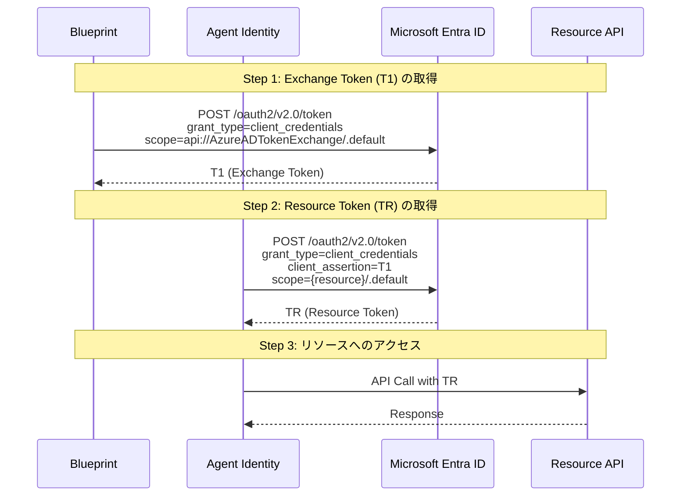
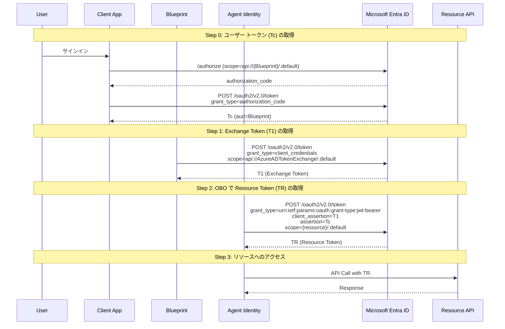
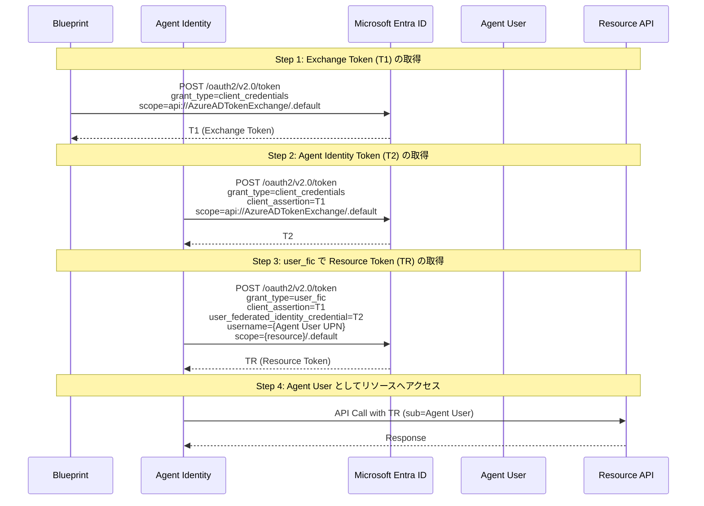

# Microsoft Entra Agent ID - REST Client リクエスト集

Microsoft Entra Agent ID の検証環境構築と認証フローを VS Code 拡張機能 [REST Client](https://marketplace.visualstudio.com/items?itemName=humao.rest-client) で実行するためのリクエスト集です。

## ファイル一覧

| ファイル | 内容 |
|---|---|
| [AgentID-Setup.http](AgentID-Setup.http) | 検証環境の構築 (権限割り当て・Agent User 作成・確認用クエリ・クリーンアップ等。Blueprint・Agent Identity・シークレットは管理センターで作成) |
| [AgentID-AutonomousAppFlow.http](AgentID-AutonomousAppFlow.http) | Autonomous App Flow - Agent ID がユーザーなしで自律的にリソースにアクセス |
| [AgentID-OBOFlow.http](AgentID-OBOFlow.http) | On-Behalf-Of Flow - サインイン済みユーザーの代理として Agent ID がリソースにアクセス |
| [AgentID-AgentUserFlow.http](AgentID-AgentUserFlow.http) | Agent User Flow - Agent ID に紐づく Agent User としてリソースにアクセス |

## 前提条件

- Agent ID (Preview) が有効な Microsoft Entra テナント
- **Agent AI Administrator** または **Agent ID Developer** ロール
- VS Code + [REST Client 拡張機能](https://marketplace.visualstudio.com/items?itemName=humao.rest-client)
- Agent ID 関連の管理操作は **Microsoft Graph beta エンドポイント** を使用 (v1.0 は未サポート。リソース API の呼び出しは v1.0 も使用可)

## セットアップ手順

### 1. Blueprint の作成 (Microsoft Entra 管理センター)

Blueprint と Blueprint Principal は Microsoft Entra 管理センターのウィザードで作成します。

1. [Microsoft Entra 管理センター](https://entra.microsoft.com/) にサインインする
2. **Entra ID** > **Agents** > **Agent Blueprints** に移動する
3. **New agent blueprint** を選択する
4. **基本** タブで **エージェント ブループリント名** を入力し、**次へ** を選択する
5. **所有者とスポンサー** タブで必要に応じて所有者・スポンサーを設定し、**次へ** を選択する
6. 設定を確認し、**作成** を選択する
7. 作成後、ブループリントの詳細ページで `Blueprint app ID`  と `Blueprint object ID` と `Blueprint principal object ID` を控える

> **Note**: Blueprint と Blueprint Principal は管理センターのウィザードで作成します。`AgentID-Setup.http` は権限割り当て・Agent User 作成・確認クエリ・クリーンアップ用です。

参考: [エージェント ID ブループリントを作成する - Microsoft Learn](https://learn.microsoft.com/ja-jp/entra/agent-id/create-blueprint?tabs=microsoft-entra-admin-center#use-the-microsoft-entra-admin-center)

### 2. Blueprint のクライアント シークレット作成 (Microsoft Entra 管理センター)

Blueprint の詳細ページからクライアント シークレットを作成します。

1. 管理センターで **Entra ID** > **Agents** > **Agent Blueprints** に移動し、手順 1 で作成した Blueprint を選択する
2. 左メニューの **開発者設定** > **資格情報** を選択する
3. **クライアント シークレット** タブを選択する
4. **新しいクライアント シークレット** を選択する
5. シークレットの **説明** を入力し、**有効期限** の期間を選択する
6. **追加** を選択する
7. 表示されたシークレット値 (`secretText`) をすぐにコピーして控える (ページを離れると再表示不可)


参考: [エージェント ID ブループリントの管理 - 資格情報を管理する](https://learn.microsoft.com/ja-jp/entra/agent-id/manage-agent-blueprint#manage-credentials)

### 2a. Blueprint の API 権限の割り当て (`AgentID-Setup.http`)

Blueprint に必要な API 権限と識別子 URI を `AgentID-Setup.http` で構成します。

1. **継承可能なアクセス許可の追加** (inheritablePermissions)
   - Blueprint の Object ID と対象リソースの appId を指定する
   - `allAllowedScopes` で対象リソースの全スコープを継承可能にする
2. **Delegated Permission の管理者同意** (Admin Consent URL)
   - REST Client でリクエストを実行し、生成された URL をブラウザで開いて管理者として同意する
   - Blueprint の appId と対象スコープ (例: `User.Read`) を指定する
3. **Application Permission (App Role) の割り当て**
   - `appRoleId` には対象リソースの App Role GUID を指定する
4. **識別子 URI とスコープの構成**
   - OBO Flow で使用する識別子 URI (`api://{BlueprintAppId}`) とスコープ (`access_agent`) を設定する
   - `scopeGuid` には `[guid]::NewGuid()` で生成した GUID を指定する
   - 参考: [識別子 URI とスコープを構成する - Microsoft Learn](https://learn.microsoft.com/ja-jp/entra/agent-id/create-blueprint?tabs=microsoft-graph-api#configure-identifier-uri-and-scope)


### 3. Agent Identity の作成 (Microsoft Entra 管理センター)

Agent Identity も管理センターのウィザードで作成します。

1. [Microsoft Entra 管理センター](https://entra.microsoft.com/) にサインインする
2. **Entra ID** > **Agents** > **Agent identities** に移動する
3. **New agent identity** を選択する
4. **基本** タブで以下を設定する:
   - **エージェント ブループリント**: 手順 1 で作成した Blueprint を選択する
   - **エージェント ID 名**: 名前を入力する
5. **所有者とスポンサー** タブで必要に応じて所有者・スポンサーを設定し、**次へ** を選択する
6. 設定を確認し、**作成** を選択する
7. 作成後、エージェント ID の詳細ページで `Blueprint App ID` と `Object ID` を控える

参考: [エージェント ID を作成する - Microsoft Learn](https://learn.microsoft.com/ja-jp/entra/agent-id/create-delete-agent-identities?tabs=microsoft-entra-admin-center#use-the-microsoft-entra-admin-center)

### 4. (OBO Flow 用) クライアント アプリの登録 (Microsoft Entra 管理センター)

OBO Flow を検証する場合、Agent ID 自身は `/authorize` エンドポイントをサポートしないため、ユーザー トークン (Tc) の取得には**別のクライアント アプリ**が必要です。
以下の手順で Microsoft Entra 管理センターからクライアント アプリを登録します。

#### 4a. クライアント アプリのアプリ登録を作成する

1. [Microsoft Entra 管理センター](https://entra.microsoft.com/) にサインインする
2. **Entra ID** > **アプリケーション** > **アプリの登録** に移動する
3. **新規登録** を選択する
4. 以下を設定する:
   - **名前**: 任意の名前を入力する (例: `OBO-ClientApp`)
   - **サポートされているアカウントの種類**: **この組織ディレクトリのみに含まれるアカウント (シングル テナント)** を選択する
   - **リダイレクト URI**: プラットフォームに **Web** を選択し、`https://jwt.ms` を入力する
5. **登録** を選択する
6. 作成後、**概要** ページで `アプリケーション (クライアント) ID` を控える

#### 4b. クライアント アプリのクライアント シークレットを作成する

1. 作成したアプリ登録の **管理** > **証明書とシークレット** に移動する
2. **クライアント シークレット** タブを選択する
3. **新しいクライアント シークレット** を選択する
4. **説明** を入力し、**有効期限** を選択する
5. **追加** を選択する
6. 表示されたシークレット値をすぐにコピーして控える (ページを離れると再表示不可)

#### 4c. Blueprint の識別子 URI とスコープを構成する

`AgentID-Setup.http` の **識別子 URI とスコープの構成** セクションを実行し、Blueprint にスコープ `access_agent` を公開します。

#### 4d. クライアント アプリに Blueprint の API 権限を追加する

1. 作成したアプリ登録の **管理** > **API のアクセス許可** に移動する
2. **アクセス許可の追加** を選択する
3. **所属する組織で使用している API** タブを選択する
4. 検索ボックスに Blueprint の名前または `Blueprint app ID` を入力して検索する
5. Blueprint を選択する
6. **委任されたアクセス許可** を選択する
7. 手順 4c で公開したスコープ (例: `access_agent`) にチェックを入れる
8. **アクセス許可の追加** を選択する

### 5. (任意) Agent User の作成 (`AgentID-Setup.http`)

Agent User Flow を検証する場合は、`AgentID-Setup.http` の **Agent User の作成 (任意)** で Agent User を作成します。

### 6. 認証フローの検証

セットアップ完了後、検証したいフローの `.http` ファイルを開いて実行します。

## Agent ID の認証フロー概要

Agent ID の認証は、従来のアプリ登録と異なり **2 段階以上のトークン交換** が必要です。
すべてのフローで共通する最初のステップは、Blueprint の資格情報で **Exchange Token (T1)** を取得することです。

```
Blueprint (資格情報) → T1 → Agent Identity (T1 を提示) → Resource Token
```

### Autonomous App Flow (App-only)

ユーザー コンテキストなしで Agent ID が自律的にリソースにアクセスするフローです。

```
Blueprint --[client_credentials]--> T1
Agent Identity --[client_credentials + T1]--> Resource Token (TR)
```



- **2 ステップ**: T1 取得 → TR 取得
- Application Permission (App Role) が必要
- `# @name` でレスポンスを変数化しているため、Step 1 → Step 2 → Step 3 の順に Send Request するだけで実行可能

### On-Behalf-Of Flow (OBO)

サインイン済みユーザーの代理として Agent ID がリソースにアクセスするフローです。

```
Client App --[authorization_code]--> Tc (aud=Blueprint)
Blueprint --[client_credentials]--> T1
Agent Identity --[jwt-bearer OBO + T1 + Tc]--> Resource Token (TR)
```



- **3 ステップ**: ユーザー トークン (Tc) 取得 → T1 取得 → OBO で TR 取得
- Delegated Permission が必要
- Exchange Token (T1) の取得時に `fmi_path` パラメータで Agent Identity の appId を指定する
- OBO で取得したリフレッシュ トークンを使用して、ユーザー操作なしでアクセス トークンを再取得可能
- **重要**: Agent ID は `/authorize` エンドポイントをサポートしないため、ユーザー トークン (Tc) は別のクライアント アプリ経由で取得する必要がある

#### OBO Flow の事前準備

OBO Flow には別のクライアント アプリが必要です。[セットアップ手順 4. (OBO Flow 用) クライアント アプリの登録](#4-obo-flow-用-クライアント-アプリの登録-microsoft-entra-管理センター) を完了してから、`AgentID-OBOFlow.http` の Step 0 でユーザー トークン (Tc) を取得してください。

### Agent User Flow (Agent's User Account Impersonation)

Agent ID に紐づく Agent User としてリソースにアクセスするフローです。
Exchange メールボックスや Teams グループ等、ユーザー オブジェクトが必要なシナリオで使用します。

```
Blueprint --[client_credentials]--> T1
Agent Identity --[client_credentials + T1]--> T2
Agent Identity --[user_fic + T1 + T2 + UPN]--> Resource Token (TR)
```



- **3 ステップ**: T1 取得 → T2 取得 → user_fic で TR 取得
- Delegated Permission が必要
- 管理センターまたは `AgentID-Setup.http` の Agent User の作成セクションで Agent User を作成しておくこと

#### Agent User Flow の事前準備

Agent User Flow では、事前に Agent User を作成する必要があります。以下の手順を完了してから `AgentID-AgentUserFlow.http` を実行してください。

1. **Delegated Permission の構成** (未実施の場合)
   - [セットアップ手順 2a. Blueprint の API 権限の割り当て](#2a-blueprint-の-api-権限の割り当て-agentid-setuphttp) の「継承可能なアクセス許可の追加」と「Delegated Permission の管理者同意」を完了する
   - Agent User Flow は Delegated Permission を使用するため、対象リソースのスコープ (例: `User.Read`) に対する管理者同意が必要

2. **Agent User の作成** (`AgentID-Setup.http`)
   - `AgentID-Setup.http` の **Agent User の作成 (任意)** セクションを実行する
   - 以下の情報を指定する:
     - `agentIdentitySpObjectId`: Agent Identity の Object ID (管理センター > Agents > Agent identities で確認)
     - `displayName`: Agent User の表示名
     - `userPrincipalName`: Agent User の UPN (例: `test-agent-user1@yourdomain.onmicrosoft.com`)
     - `mailNickname`: メール ニックネーム
   - `identityParentId` に Agent Identity の Object ID を指定することで、Agent User が Agent Identity に紐づけられる

3. **Agent User の UPN を控える**
   - 作成した Agent User の `userPrincipalName` を `AgentID-AgentUserFlow.http` の `agentUserUpn` 変数に設定する

## 注意事項

### クライアント シークレットについて

本リクエスト集では検証の簡便さのためクライアント シークレットを使用していますが、**本番環境ではマネージド ID (Federated Identity Credential) を使用してください**。

> Client secrets shouldn't be used as client credentials in production environments for agent identity blueprints due to security risks.
>
> — [Authentication protocols in agents - Microsoft Learn](https://learn.microsoft.com/en-us/entra/agent-id/agent-oauth-protocols)

### 変数の値について

- 各リクエストの変数にはプレースホルダーが設定されています。実際の値に置き換えてから実行してください
- 変数の値は `" "` で囲わないでください (REST Client の仕様)
- 各フロー共通の変数 (例: `blueprintAppId`, `agentIdentityAppId`) はファイル先頭で一度だけ定義し、各 Step で共有します

### Agent ID の制約

- **Interactive Flow 非対応**: Agent ID は `/authorize` エンドポイントをサポートしません。すべての認証はプログラマティックなトークン交換で行います
- **Confidential Client のみ**: Public Client はサポートされません
- **Redirect URI なし**: Agent ID にはリダイレクト URI を設定できません
- **シングル テナント**: Agent Identity は作成されたテナント内でのみ動作します
- **Graph beta 必須**: Agent ID 関連の API 操作は beta エンドポイントが必要です

## 参考ドキュメント

- [Microsoft Entra Agent ID documentation](https://learn.microsoft.com/en-us/entra/agent-id/)
- [Authentication protocols in agents](https://learn.microsoft.com/en-us/entra/agent-id/agent-oauth-protocols)
- [Agent autonomous app OAuth flow](https://learn.microsoft.com/en-us/entra/agent-id/agent-autonomous-app-oauth-flow)
- [Agent on-behalf-of OAuth flow](https://learn.microsoft.com/en-us/entra/agent-id/agent-on-behalf-of-oauth-flow)
- [Agent's user account impersonation protocol](https://learn.microsoft.com/en-us/entra/agent-id/agent-user-oauth-flow)
- [Create Agent Identity Blueprint](https://learn.microsoft.com/en-us/entra/agent-id/create-blueprint?tabs=microsoft-entra-admin-center)
- [Create and delete agent identities](https://learn.microsoft.com/en-us/entra/agent-id/create-delete-agent-identities)
